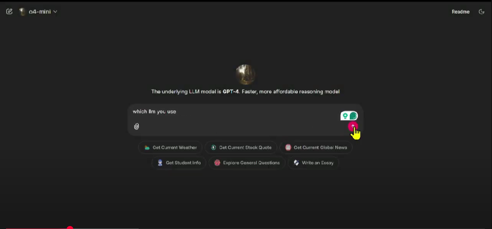

# Chatbot using OpenAI Agent SDK and Chainlit

This project is built using the Chainlit starter template and includes multiple tools integrated with different LLM profiles.

## ✅ Features

- **Chainlit Starter Template** 
- **Three LLM Profiles**:
  - Gemini
  - gpt-4o-mini
  - gpt-40-mini
- **Custom Tools**:
  - Current Weather
  - Stock Exchange Rate
  - Global News (via Alpha Vantage News Sentiment API)
- **Streaming Responses**:
  - Answers are streamed character by character for a better user experience.
- **Chat History**:
  - All conversations are saved in `chat_history.json`.

## 🛠️ Running Instructions

1. ```bash
    uv run chainlit run chatbot.py -w  

[Click here to watch video](https://youtu.be/cgZN9VCvzNw)


